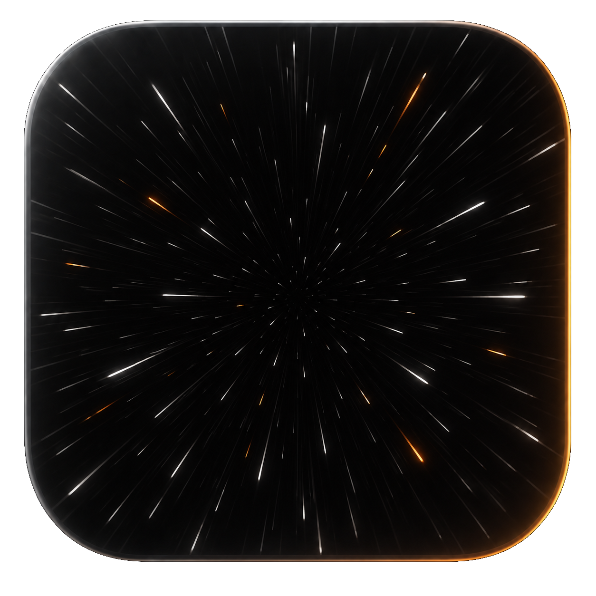
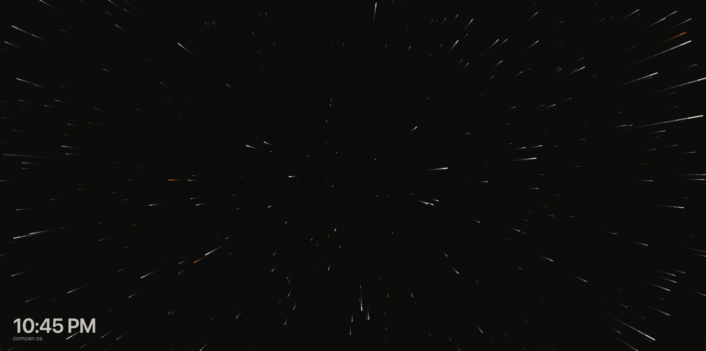

<p align="center">
  
</p>
<p align="center">
  
  <a href="https://opensource.org/licenses/MIT">
    
  </a>
</p>

# 🌌 Starfield Screensaver

A 90s flight through space, on **Windows, macOS, and Linux**. Stars stream out from the center of the screen, leaving short streaks that fade like a CRT's afterglow, and about one in fourteen glows orange. It started on [maxhayim.com](https://maxhayim.com).

<p align="center">
  
</p>

This repository contains:
- **core/** — the flight and a small software renderer in plain C, shared by all three systems
- **macos/** — the `.saver` for macOS (Swift)
- **windows/** — the `.scr` for Windows (C, GDI)
- **linux/** — the XScreenSaver hack for Linux (C, Xlib)
- **web/** — the web version for web pages (the core in WebAssembly, and JavaScript)
- **tests/** and **tools/** — tests and preview renderers
- **docs/** — the developer guide, the logo, and the screenshot

---

## What it shows

| On screen | What it means |
| --- | --- |
| **Stars** | Streaming out from the center as you fly through them; closer stars are brighter, thicker, and faster |
| **Streaks** | Where each star just was, fading like a CRT's afterglow |
| **Accent stars** | About one in fourteen stars, orange unless you pick another color |
| **Clock** | The time in the bottom-left corner, with your name, your username, or your own text under it if you like |

Design goals:
- Free, with nothing to sign up for
- Offline: it never connects to anything
- Your colors, with presets to start from
- Small native programs on every system, no web view

---

## Installing

Download the file for your computer from the [latest release](https://github.com/maxhayim/screensaver-starfield/releases/latest):

| System | File |
| --- | --- |
| macOS 11 and later (Apple silicon and Intel) | `screensaver-starfield-<version>-macos.zip` |
| Windows 10 and 11 (64-bit) | `screensaver-starfield-<version>-windows.zip` |
| Linux with XScreenSaver (x86-64) | `screensaver-starfield-<version>-linux-x86_64.tar.gz` |
| Linux with XScreenSaver (64-bit ARM, like a Raspberry Pi 4 or 5) | `screensaver-starfield-<version>-linux-arm64.tar.gz` |

Starfield isn't code-signed or notarized (that costs money every year), so macOS and Windows warn you the first time. The steps below get you past that once.

### macOS

1. Unzip and double-click `Starfield.saver`, then choose to install it for this user.
2. macOS blocks it the first time. Open **System Settings → Privacy & Security**, scroll down, and click **Open Anyway**. Or run this in Terminal:
   ```
   xattr -d com.apple.quarantine ~/Library/Screen\ Savers/Starfield.saver
   ```
3. Choose **Starfield** in **System Settings → Screen Saver**, and click **Options…** to set it up.

### Windows

1. Unzip, and keep `Starfield.scr` somewhere permanent, like `Documents\Starfield`.
2. Right-click `Starfield.scr` and choose **Install**. If Windows says "Windows protected your PC", click **More info**, then **Run anyway**. If it doesn't start at all, right-click it, choose **Properties**, tick **Unblock**, and click **OK**.
3. In **Screen Saver Settings**, choose **Starfield** and click **Settings** to set it up.

### Linux

1. Install XScreenSaver if you don't have it (for example `sudo apt install xscreensaver`).
2. Unpack the tarball and run `./install.sh`.
3. Choose **Starfield** in `xscreensaver-settings`. Try it in a window first with `./screensaver-starfield -window`.

GNOME and KDE don't support third-party screen savers, so XScreenSaver is the way to run it on Linux.

### On a web page

The web version runs the same core, compiled to WebAssembly, in a `<canvas>`. It has no dependencies, and installing it needs no build:

```
npm install github:maxhayim/screensaver-starfield#v0.4.0
```

```js
import { createSaver, cleanSettings } from "screensaver-starfield";

const saver = createSaver(document.querySelector("canvas"), {
  settings: cleanSettings(JSON.parse(localStorage.starfield ?? "{}")),
  userName: "Max",  // shown for "Your name" and "Your username"
});
saver.update({ preset: "Synthwave" });  // live changes
saver.destroy();                         // when the page is done with it
```

`SETTINGS` lists every setting with its label, type, range, and default, so a page can build its own settings panel. [web/demo.html](web/demo.html) is one: serve the repository (`python3 -m http.server`) and open `/web/demo.html`. See [docs/GUIDE.md](docs/GUIDE.md#web) for the whole interface.

### Updating

Install the new release over the old one: double-click the new `Starfield.saver` on macOS, replace `Starfield.scr` in the same folder on Windows, or run the new `install.sh` on Linux. Your settings carry over.

---

## Using it

### Colors

Pick the background, stars, and accent stars, or start from a preset: **Original**, **Classic**, **Deep space**, **Green terminal**, **Amber terminal**, **Synthwave**, or **Paper**.

### Flight

- **Accent stars:** how many stars get the accent color, from none to half. The original is 7%.
- **Speed:** from a quarter of the original speed up to 3×.
- **Trails:** how long the streaks linger.

The flight also slows down when your system asks for less motion: **Reduce motion** on macOS, **Show animations in Windows** turned off on Windows, or the **Reduce motion** box on Linux.

### Clock and label

Show the clock or hide it, in 12- or 24-hour time. The line under it can show **your name** (the full name on your computer account), **your username**, or **your own text**, in any language. It's off unless you turn it on, and it stays even with the clock hidden.

### Where the settings are

- **macOS:** **Options…** next to Starfield in **System Settings → Screen Saver**
- **Windows:** **Settings** in **Screen Saver Settings**
- **Linux:** the Starfield page in `xscreensaver-settings`, or flags on the command line (`./screensaver-starfield -help`)
- **Web:** whatever the page builds from `SETTINGS`, passed to `createSaver` and `update`

---

## Privacy

- Starfield never connects to the internet or any other computer.
- It keeps only its own settings: in the screen saver's preferences on macOS, in the registry under `HKEY_CURRENT_USER\Software\maxhayim\Starfield` on Windows, and in `~/.xscreensaver` on Linux.
- The name or text under the clock is shown to anyone who can see your screen, so it's off by default.

---

## Repository layout

```
core/starfield.c      the flight, drawn through three callbacks (fill, line, circle)
core/canvas.c         the software renderer for Windows and Linux, and the clock's font
core/presets.h        color presets and defaults
macos/                the .saver: the view, the Options sheet, settings, thumbnails
windows/              the .scr: Win32 + GDI, the settings dialog, install notes
linux/                the XScreenSaver hack, its settings XML, installer, and install notes
web/                  the web version: index.js, the WebAssembly core (built, and committed), demo.html
tests/                core and renderer tests
tools/                preview renderers for macOS and for Windows/Linux drawing
docs/GUIDE.md         developer guide
docs/assets/          logo and screenshot
```

---

## Changing it

See [docs/GUIDE.md](docs/GUIDE.md).

```
macos/build.sh        # build/Starfield.saver (needs the Xcode command-line tools)
windows/build.sh      # build/Starfield.scr (cross-compiles with mingw-w64)
make -C linux         # build/screensaver-starfield (needs libx11, libxext, and libxft dev packages)
web/build.sh          # web/starfield.wasm, web/wasm.js, web/presets.js (needs zig and node)
```

GitHub Actions builds and tests all three on every push, and publishes a release for every version tag.

---

## Versioning

This project follows semantic versioning.

- **v0.4.0** — a web version for web pages, from the same core
- **v0.3.1** — the macOS Options window opens again, with copy and paste
- **v0.3.0** — a picture in the macOS screen saver list, install notes in every download, and the Linux program renamed `screensaver-starfield`
- **v0.2.0** — your name, your username, or your own text under the clock
- **v0.1.0** — the Starfield screen saver for macOS, Windows, and Linux

See [CHANGELOG.md](CHANGELOG.md) for details.

---

## License

This project is licensed under the MIT License.

See the [LICENSE](LICENSE) file for details.  
Full license text: https://opensource.org/licenses/MIT

---

## Contributing

Pull requests are welcome. Open an issue first to discuss ideas or report bugs. See [CONTRIBUTING.md](CONTRIBUTING.md).

---

## Acknowledgments

* The original starfield on [maxhayim.com](https://maxhayim.com)
* [XScreenSaver](https://www.jwz.org/xscreensaver/) by Jamie Zawinski
* [Xft](https://gitlab.freedesktop.org/xorg/lib/libxft) for text on Linux, and [MinGW-w64](https://www.mingw-w64.org/) for building on Windows
